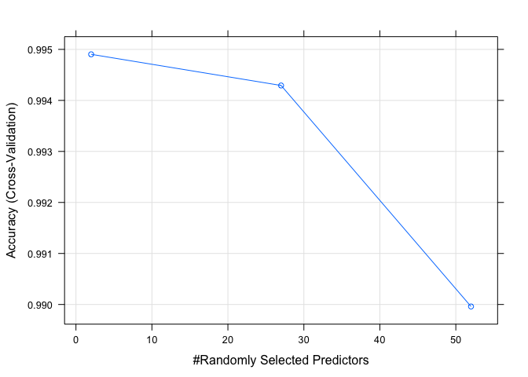

## Overview
This is a Coursera course project for Practical Machine Learning. The goal of this project is to build a model to predict the manner in which they did the exercise based on an exercise dataset. The data is from http://web.archive.org/web/20161224072740/http:/groupware.les.inf.puc-rio.br/har.

## Data processing

```r
training <- read.csv("https://d396qusza40orc.cloudfront.net/predmachlearn/pml-training.csv")
testing <- read.csv("https://d396qusza40orc.cloudfront.net/predmachlearn/pml-testing.csv")
```
There are five classes of the exercises.

```r
unique(training$classe)
```

```
## [1] "A" "B" "C" "D" "E"
```

Clean up the data

```r
# remove columns containing NA 
validCols <- !(sapply(training,anyNA) | sapply(testing,anyNA))
training <- training[,validCols]
testing <- testing[,validCols]
# remove first 7 meaningless columns
training <- training[,-c(1:7)]
testing <- testing[,-c(1:7)]
```


## building a random forest classifier


```r
require(caret)
require(doMC)
doMC::registerDoMC(cores = 14)
set.seed(55)
control <- trainControl(method="cv", number=10)
rfFit <- train(classe ~ ., data=training, method="rf", trControl=control)
```


```r
rfFit
```

```
## Random Forest 
## 
## 19622 samples
##    52 predictor
##     5 classes: 'A', 'B', 'C', 'D', 'E' 
## 
## No pre-processing
## Resampling: Cross-Validated (10 fold) 
## Summary of sample sizes: 17660, 17661, 17660, 17660, 17659, 17660, ... 
## Resampling results across tuning parameters:
## 
##   mtry  Accuracy   Kappa    
##    2    0.9949032  0.9935527
##   27    0.9942921  0.9927800
##   52    0.9899607  0.9873005
## 
## Accuracy was used to select the optimal model using the largest value.
## The final value used for the model was mtry = 2.
```

```r
plot(rfFit)
```

<!-- -->


```r
head(predict(rfFit,testing),n=20)
```

```
##  [1] B A B A A E D B A A B C B A E E A B B B
## Levels: A B C D E
```


